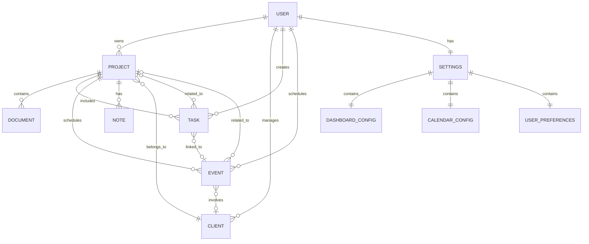

# 로컬스토리지 데이터 스키마 설계

## 📋 목차
1. [개요](#개요)
2. [데이터 모델](#데이터-모델)
3. [스키마 정의](#스키마-정의)
4. [관계 정의](#관계-정의)
5. [키 네이밍 규칙](#키-네이밍-규칙)
6. [버전 관리](#버전-관리)

## 개요

### 설계 원칙
- **Supabase 호환성**: 향후 마이그레이션을 위한 1:1 매핑
- **정규화**: 데이터 중복 최소화
- **타입 안정성**: TypeScript 인터페이스 완전 지원
- **확장성**: 새로운 엔티티 쉽게 추가

### 데이터 계층 구조
```
Users (사용자)
  └── Projects (프로젝트)
      ├── Documents (문서)
      ├── Tasks (할일)
      ├── Events (일정)
      └── Notes (메모)
  └── Clients (클라이언트)
  └── Settings (설정)
      ├── Dashboard (대시보드 설정)
      ├── Calendar (캘린더 설정)
      └── Preferences (사용자 설정)
```

## 데이터 모델

### 엔티티 관계도 (ERD)



## 스키마 정의

### 1. User (사용자)

```typescript
interface User {
  id: string;                    // UUID
  email: string;
  name: string;
  avatar?: string;
  createdAt: string;             // ISO 8601
  updatedAt: string;             // ISO 8601
  metadata?: {
    theme?: 'light' | 'dark';
    language?: 'ko' | 'en';
    timezone?: string;
  };
}

// LocalStorage Key: user:current
```

### 2. Project (프로젝트)

```typescript
interface Project {
  id: string;                    // UUID
  userId: string;                // Foreign Key
  clientId?: string;             // Foreign Key (optional)

  // 기본 정보
  no: string;                    // 프로젝트 번호 (예: WEAVE_001)
  name: string;
  description?: string;

  // 상태
  status: 'planning' | 'in_progress' | 'review' | 'completed' | 'on_hold' | 'cancelled';
  progress: number;              // 0-100
  paymentProgress: number;       // 0-100

  // 일정
  startDate?: string;            // ISO 8601
  endDate?: string;              // ISO 8601
  registrationDate: string;      // ISO 8601
  modifiedDate: string;          // ISO 8601

  // 금액
  budget?: number;
  actualCost?: number;
  currency?: string;             // KRW, USD, etc

  // 플래그
  hasContract: boolean;
  hasBilling: boolean;
  hasDocuments: boolean;

  // 메타데이터
  tags?: string[];
  priority?: 'low' | 'medium' | 'high' | 'urgent';
  visibility?: 'private' | 'team' | 'public';

  createdAt: string;
  updatedAt: string;
}

// LocalStorage Key: projects
// 저장 형식: Project[]
```

### 3. Client (클라이언트)

```typescript
interface Client {
  id: string;                    // UUID
  userId: string;                // Foreign Key

  // 기본 정보
  name: string;
  company?: string;
  email?: string;
  phone?: string;

  // 주소
  address?: {
    street?: string;
    city?: string;
    state?: string;
    zipCode?: string;
    country?: string;
  };

  // 비즈니스 정보
  businessNumber?: string;       // 사업자등록번호
  taxId?: string;                // 세금 ID
  website?: string;
  industry?: string;

  // 연락처
  contacts?: Array<{
    name: string;
    role?: string;
    email?: string;
    phone?: string;
    isPrimary?: boolean;
  }>;

  // 메타데이터
  tags?: string[];
  notes?: string;
  rating?: number;               // 1-5

  createdAt: string;
  updatedAt: string;
}

// LocalStorage Key: clients
// 저장 형식: Client[]
```

### 4. Task (할일)

```typescript
interface Task {
  id: string;                    // UUID
  userId: string;                // Foreign Key
  projectId?: string;            // Foreign Key (optional)

  // 기본 정보
  title: string;
  description?: string;

  // 상태
  status: 'pending' | 'in_progress' | 'completed' | 'cancelled';
  priority: 'low' | 'medium' | 'high' | 'urgent';

  // 일정
  dueDate?: string;              // ISO 8601
  startDate?: string;            // ISO 8601
  completedAt?: string;          // ISO 8601

  // 할당
  assigneeId?: string;           // User ID

  // 관계
  parentTaskId?: string;         // 상위 작업
  subtasks?: string[];           // 하위 작업 IDs
  dependencies?: string[];       // 의존 작업 IDs

  // 추적
  estimatedHours?: number;
  actualHours?: number;

  // 메타데이터
  tags?: string[];
  attachments?: Array<{
    name: string;
    url?: string;
    size?: number;
    type?: string;
  }>;

  // 반복 설정
  recurring?: {
    pattern: 'daily' | 'weekly' | 'monthly' | 'yearly';
    interval?: number;
    endDate?: string;
    daysOfWeek?: number[];      // 0-6 (일-토)
  };

  createdAt: string;
  updatedAt: string;
}

// LocalStorage Key: tasks
// 저장 형식: Task[]
```

### 5. Event (일정)

```typescript
interface CalendarEvent {
  id: string;                    // UUID
  userId: string;                // Foreign Key
  projectId?: string;            // Foreign Key (optional)
  clientId?: string;             // Foreign Key (optional)

  // 기본 정보
  title: string;
  description?: string;
  location?: string;

  // 시간
  startDate: string;             // ISO 8601
  endDate: string;               // ISO 8601
  allDay?: boolean;
  timezone?: string;

  // 타입
  type: 'meeting' | 'deadline' | 'milestone' | 'reminder' | 'other';
  category?: 'work' | 'personal' | 'project' | 'client';

  // 상태
  status?: 'confirmed' | 'tentative' | 'cancelled';

  // 참석자
  attendees?: Array<{
    name: string;
    email?: string;
    status?: 'accepted' | 'declined' | 'maybe' | 'pending';
  }>;

  // 알림
  reminders?: Array<{
    type: 'email' | 'popup' | 'notification';
    minutes: number;            // 이벤트 전 분 단위
  }>;

  // 반복
  recurring?: {
    pattern: 'daily' | 'weekly' | 'monthly' | 'yearly';
    interval?: number;
    endDate?: string;
    daysOfWeek?: number[];
    exceptions?: string[];       // 제외 날짜들
  };

  // 메타데이터
  color?: string;
  tags?: string[];

  createdAt: string;
  updatedAt: string;
}

// LocalStorage Key: events
// 저장 형식: CalendarEvent[]
```

### 6. Document (문서)

```typescript
interface Document {
  id: string;                    // UUID
  projectId: string;             // Foreign Key
  userId: string;                // Foreign Key

  // 기본 정보
  name: string;
  type: 'contract' | 'invoice' | 'estimate' | 'report' | 'other';

  // 상태
  status: 'draft' | 'complete' | 'archived';

  // 내용
  content?: string;              // Markdown or HTML
  templateId?: string;           // 템플릿 ID

  // 메타데이터
  version?: number;
  tags?: string[];
  size?: number;                 // 바이트

  // 서명 (계약서용)
  signatures?: Array<{
    name: string;
    signedAt?: string;
    ip?: string;
  }>;

  savedAt: string;               // ISO 8601
  createdAt: string;
  updatedAt: string;
}

// LocalStorage Key: documents:[projectId]
// 저장 형식: Document[]
```

### 7. Settings (설정)

```typescript
interface Settings {
  userId: string;

  // 대시보드 설정
  dashboard: {
    layout: {
      widgets: Array<{
        id: string;
        type: string;
        position: { x: number; y: number; w: number; h: number };
        config?: any;
      }>;
      columns: number;
      rowHeight: number;
      gap: number;
    };
    theme?: 'light' | 'dark' | 'auto';
  };

  // 캘린더 설정
  calendar: {
    defaultView: 'month' | 'week' | 'day' | 'list';
    weekStartsOn: 0 | 1;         // 0: 일요일, 1: 월요일
    workingHours?: {
      start: string;              // HH:mm
      end: string;                // HH:mm
    };
    holidays?: string[];          // ISO 8601 날짜들
    defaultReminders?: number[];  // 분 단위
  };

  // 프로젝트 설정
  projects: {
    defaultView: 'list' | 'grid' | 'kanban';
    sortBy?: 'name' | 'date' | 'status' | 'priority';
    sortOrder?: 'asc' | 'desc';
    itemsPerPage?: number;
  };

  // 알림 설정
  notifications: {
    email?: boolean;
    push?: boolean;
    desktop?: boolean;
    sound?: boolean;
    taskReminders?: boolean;
    eventReminders?: boolean;
    projectDeadlines?: boolean;
  };

  // 사용자 설정
  preferences: {
    language: 'ko' | 'en';
    timezone: string;
    dateFormat?: string;
    timeFormat?: '12' | '24';
    currency?: string;
    numberFormat?: string;
  };

  updatedAt: string;
}

// LocalStorage Key: settings
// 저장 형식: Settings
```

## 관계 정의

### 1:N 관계
- User → Projects
- User → Clients
- User → Tasks
- User → Events
- Project → Documents
- Project → Tasks
- Project → Events
- Client → Projects

### N:M 관계 (조인 테이블)
- Tasks ↔ Events (연결된 작업과 일정)
- Projects ↔ Tags (프로젝트 태그)

## 키 네이밍 규칙

### 기본 규칙
```
{entity}                        # 엔티티 전체 목록
{entity}:{id}                   # 특정 엔티티
{entity}:{parentEntity}:{parentId}  # 관계 데이터
```

### 예시
```
user:current                    # 현재 로그인 사용자
projects                        # 모든 프로젝트 목록
project:abc123                  # 특정 프로젝트
documents:project:abc123        # 프로젝트의 문서들
tasks:project:abc123            # 프로젝트의 할일들
events:client:xyz789            # 클라이언트 관련 일정들
settings                        # 사용자 설정
```

### 메타데이터 키
```
_version                        # 스키마 버전
_lastSync                       # 마지막 동기화 시간
_migrations                     # 적용된 마이그레이션
```

## 버전 관리

### 스키마 버전
```typescript
interface SchemaVersion {
  version: number;
  appliedAt: string;
  migrations: string[];
}

// LocalStorage Key: _version
```

### 마이그레이션 전략

```typescript
// 버전 1 → 2 마이그레이션 예시
async function migrateV1ToV2(data: any): Promise<void> {
  // 1. 기존 데이터 백업
  await backup(data);

  // 2. 스키마 변경 적용
  const projects = data.projects || [];
  const migratedProjects = projects.map(p => ({
    ...p,
    // 새 필드 추가
    priority: p.priority || 'medium',
    visibility: 'private'
  }));

  // 3. 저장
  await storage.set('projects', migratedProjects);

  // 4. 버전 업데이트
  await storage.set('_version', {
    version: 2,
    appliedAt: new Date().toISOString(),
    migrations: ['v1-to-v2']
  });
}
```

## 데이터 검증

### JSON Schema 검증

```typescript
// 프로젝트 스키마 검증
const projectSchema = {
  type: 'object',
  required: ['id', 'userId', 'no', 'name', 'status'],
  properties: {
    id: { type: 'string', format: 'uuid' },
    userId: { type: 'string', format: 'uuid' },
    no: { type: 'string', pattern: '^WEAVE_\\d{3}$' },
    name: { type: 'string', minLength: 1, maxLength: 200 },
    status: {
      type: 'string',
      enum: ['planning', 'in_progress', 'review', 'completed', 'on_hold', 'cancelled']
    },
    progress: { type: 'number', minimum: 0, maximum: 100 },
    // ... 나머지 필드
  }
};
```

### TypeScript 타입 가드

```typescript
// 타입 가드 함수
function isProject(data: unknown): data is Project {
  return (
    typeof data === 'object' &&
    data !== null &&
    'id' in data &&
    'userId' in data &&
    'name' in data &&
    'status' in data
  );
}

// 사용 예시
const data = await storage.get('projects');
if (Array.isArray(data) && data.every(isProject)) {
  // 타입 안전하게 사용
  const projects: Project[] = data;
}
```

## Supabase 마이그레이션 준비

### 테이블 매핑

| LocalStorage Key | Supabase Table | 비고 |
|-----------------|----------------|------|
| `user:current` | `users` | 인증 시스템 통합 |
| `projects` | `projects` | 1:1 매핑 |
| `clients` | `clients` | 1:1 매핑 |
| `tasks` | `tasks` | 1:1 매핑 |
| `events` | `calendar_events` | 테이블명 변경 |
| `documents:[projectId]` | `documents` | 구조 평탄화 |
| `settings` | `user_settings` | 테이블명 변경 |

### SQL 스키마 예시

```sql
-- Projects 테이블
CREATE TABLE projects (
  id UUID PRIMARY KEY DEFAULT gen_random_uuid(),
  user_id UUID NOT NULL REFERENCES users(id) ON DELETE CASCADE,
  client_id UUID REFERENCES clients(id),
  no VARCHAR(20) NOT NULL UNIQUE,
  name VARCHAR(200) NOT NULL,
  description TEXT,
  status VARCHAR(20) NOT NULL,
  progress INTEGER DEFAULT 0,
  payment_progress INTEGER DEFAULT 0,
  start_date DATE,
  end_date DATE,
  registration_date TIMESTAMP NOT NULL DEFAULT NOW(),
  modified_date TIMESTAMP NOT NULL DEFAULT NOW(),
  budget DECIMAL(15, 2),
  actual_cost DECIMAL(15, 2),
  currency VARCHAR(3) DEFAULT 'KRW',
  has_contract BOOLEAN DEFAULT false,
  has_billing BOOLEAN DEFAULT false,
  has_documents BOOLEAN DEFAULT false,
  tags TEXT[],
  priority VARCHAR(10) DEFAULT 'medium',
  visibility VARCHAR(10) DEFAULT 'private',
  created_at TIMESTAMP DEFAULT NOW(),
  updated_at TIMESTAMP DEFAULT NOW()
);

-- RLS 정책
ALTER TABLE projects ENABLE ROW LEVEL SECURITY;

CREATE POLICY "Users can view own projects"
  ON projects FOR SELECT
  USING (auth.uid() = user_id);

CREATE POLICY "Users can insert own projects"
  ON projects FOR INSERT
  WITH CHECK (auth.uid() = user_id);

CREATE POLICY "Users can update own projects"
  ON projects FOR UPDATE
  USING (auth.uid() = user_id);

CREATE POLICY "Users can delete own projects"
  ON projects FOR DELETE
  USING (auth.uid() = user_id);
```

## 성능 최적화

### 인덱싱 전략
```typescript
// 인덱스 키 생성
const indices = {
  projectsByStatus: new Map<string, string[]>(),
  tasksByProject: new Map<string, string[]>(),
  eventsByDate: new Map<string, string[]>()
};

// 인덱스 업데이트
function updateIndices(project: Project) {
  const statusIndex = indices.projectsByStatus.get(project.status) || [];
  statusIndex.push(project.id);
  indices.projectsByStatus.set(project.status, statusIndex);
}
```

### 데이터 압축
```typescript
// LZ-String 압축 (큰 데이터용)
import LZString from 'lz-string';

function compressData(data: any): string {
  return LZString.compressToUTF16(JSON.stringify(data));
}

function decompressData(compressed: string): any {
  return JSON.parse(LZString.decompressFromUTF16(compressed));
}
```

## 다음 단계

1. **TypeScript 인터페이스** 파일 생성
2. **검증 스키마** 구현
3. **마이그레이션 스크립트** 작성
4. **테스트 데이터** 생성

---

*작성일: 2025-01-03*
*버전: 1.0.0*
*작성자: Claude Code*