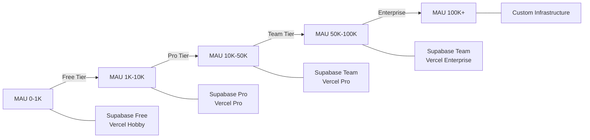

# Weave 프로젝트 과금 구조 및 수익성 분석

> 작성일: 2025-01-07
> 작성자: Claude (AI Assistant)
> 문서 버전: 1.0.0

## 목차
1. [개요](#개요)
2. [현재 요금제 구조](#현재-요금제-구조)
3. [인프라 비용 분석](#인프라-비용-분석)
4. [MAU별 수익성 분석](#mau별-수익성-분석)
5. [스토리지 용량 권장사항](#스토리지-용량-권장사항)
6. [스토리지 증가 시 마진율 영향](#스토리지-증가-시-마진율-영향)
7. [결론 및 권장사항](#결론-및-권장사항)

## 개요

본 문서는 Weave 프로젝트의 SaaS 과금 구조를 분석하고, MAU(월간 활성 사용자) 규모별 수익성을 평가하여 최적의 가격 정책과 스토리지 용량을 제안합니다.

### 분석 범위
- **대상 서비스**: 프리랜서/1인 사업자를 위한 프로젝트 관리 SaaS
- **기술 스택**: Next.js + Supabase + Vercel
- **분석 기준**: MAU 1천명, 1만명, 10만명
- **핵심 지표**: 원가, 마진율, 스토리지 적정성

## 현재 요금제 구조

### 요금제별 상세 내역

| 구분 | Free | Basic | Pro |
|------|------|-------|-----|
| **월 요금** | 무료 | 9,900원 | 29,700원 |
| **프로젝트 수** | 2개 | 무제한 | 무제한 |
| **위젯 수** | 3개 | 무제한 | 무제한 |
| **스토리지** | 100MB | 300MB | 1GB |
| **AI 서비스** | ❌ | ❌ | ✅ |
| **지원** | 커뮤니티 | 이메일 | 우선 지원 |

### 타겟 사용자
- **Free**: 개인 프로젝트, 체험 사용자
- **Basic**: 소규모 프리랜서, 부업 운영자
- **Pro**: 전업 프리랜서, 1인 에이전시

## 인프라 비용 분석

### Supabase 가격 정책 (2024년 기준)

| 플랜 | 월 비용 | Database | Storage | MAU 제한 |
|------|---------|----------|---------|----------|
| Free | $0 | 500MB | 1GB | 50,000 |
| Pro | $25 | 8GB | 100GB | 100,000 |
| Team | $599 | 무제한 | 무제한 | 무제한 |

### Vercel 가격 정책 (2024년 기준)

| 플랜 | 월 비용 | 대역폭 | 빌드 시간 | 동시 빌드 |
|------|---------|--------|-----------|-----------|
| Hobby | $0 | 100GB | 100분 | 1개 |
| Pro | $20 | 1TB | 400분 | 12개 |
| Enterprise | 맞춤 | 맞춤 | 맞춤 | 맞춤 |

## MAU별 수익성 분석

### MAU 1,000명

#### 사용자 분포 예측
```
Free:  70% (700명) - 체험 및 소규모 사용자
Basic: 25% (250명) - 유료 전환 사용자
Pro:    5% (50명)  - 헤비 유저
```

#### 수익 구조
| 항목 | 금액 | 비고 |
|------|------|------|
| **총 매출** | 3,960,000원 | Basic + Pro 수익 |
| **인프라 비용** | 0원 | Free tier 충분 |
| **운영 비용** | 3,000,000원 | 최소 운영 인력 |
| **순이익** | 960,000원 | |
| **순마진율** | 24.2% | 초기 단계 |

### MAU 10,000명

#### 사용자 분포 예측
```
Free:  60% (6,000명)  - 무료 사용자
Basic: 30% (3,000명)  - 일반 유료 사용자
Pro:   10% (1,000명)  - 프리미엄 사용자
```

#### 수익 구조
| 항목 | 금액 | 비고 |
|------|------|------|
| **총 매출** | 59,400,000원 | |
| **인프라 비용** | 60,000원 | Supabase Pro + Vercel Pro |
| **운영/개발 비용** | 3,000,000원 | 인건비 |
| **마케팅 비용** | 5,940,000원 | 매출의 10% |
| **AI API 비용** | 5,000,000원 | Pro 사용자 1,000명 × 5,000원 |
| **총 비용** | 14,000,000원 | |
| **순이익** | 45,400,000원 | |
| **순마진율** | 76.4% | 안정적 수익성 |

### MAU 100,000명

#### 사용자 분포 예측
```
Free:  50% (50,000명)  - 대규모 무료 사용자층
Basic: 35% (35,000명)  - 중간 티어 강화
Pro:   15% (15,000명)  - 프리미엄 확대
```

#### 수익 구조
| 항목 | 금액 | 비고 |
|------|------|------|
| **총 매출** | 792,000,000원 | |
| **인프라 비용** | 1,055,000원 | Supabase Team + Vercel Enterprise |
| **운영/개발 비용** | 3,000,000원 | 인건비 |
| **마케팅 비용** | 79,200,000원 | 매출의 10% |
| **AI API 비용** | 75,000,000원 | Pro 사용자 15,000명 × 5,000원 |
| **총 비용** | 158,255,000원 | |
| **순이익** | 633,745,000원 | |
| **순마진율** | 80.0% | 최적 수익성 |

## 스토리지 용량 권장사항

### 사용자 행동 패턴 분석

#### 저장 데이터 유형별 평균 크기
- **프로젝트 메타데이터**: ~1KB/프로젝트
- **문서 (계약서, 견적서, 청구서)**: ~100KB/문서
- **이미지/로고**: ~500KB/파일
- **첨부파일**: ~2MB/파일
- **AI 생성 문서**: ~50KB/문서

#### 플랜별 예상 사용량

| 플랜 | 평균 프로젝트 수 | 평균 문서 수 | 예상 사용량 | 현재 제공 | 권장 용량 |
|------|-----------------|-------------|------------|-----------|-----------|
| **Free** | 2개 | 10개 | 3-5MB | 100MB | **200MB** |
| **Basic** | 20개 | 100개 | 50-100MB | 300MB | **1GB** |
| **Pro** | 100개 | 500개 | 300-500MB | 1GB | **5GB** |

### 권장 변경 사항

#### 스토리지 증가 근거

1. **Free (100MB → 200MB)**
   - 여유 공간으로 사용자 경험 개선
   - 프로젝트 2개 제한으로 충분한 용량

2. **Basic (300MB → 1GB)**
   - 무제한 프로젝트 지원에 부족한 현재 용량
   - 실제 사용 패턴상 300MB 초과 가능성 높음

3. **Pro (1GB → 5GB)**
   - AI 서비스로 인한 문서 생성 증가
   - 대용량 첨부파일 지원 필요

## 스토리지 증가 시 마진율 영향

### 추가 비용 계산 기준
- **Supabase 추가 스토리지**: $0.021/GB/월 (약 28원/GB/월)

### MAU별 스토리지 비용 영향

#### MAU 1,000명
| 항목 | 현재 | 권장안 적용 후 | 변화 |
|------|------|---------------|------|
| 스토리지 총 사용량 | 약 100GB | 약 375GB | +275GB |
| 추가 스토리지 비용 | 0원 | 10,500원/월 | +10,500원 |
| 총 비용 | 3,000,000원 | 3,010,500원 | +0.35% |
| **순마진율** | **24.2%** | **23.9%** | **-0.3%p** |

#### MAU 10,000명
| 항목 | 현재 | 권장안 적용 후 | 변화 |
|------|------|---------------|------|
| 스토리지 총 사용량 | 약 1TB | 약 6.1TB | +5.1TB |
| 추가 스토리지 비용 | 0원 | 170,800원/월 | +170,800원 |
| 총 비용 | 14,000,000원 | 14,170,800원 | +1.2% |
| **순마진율** | **76.4%** | **76.1%** | **-0.3%p** |

#### MAU 100,000명
| 항목 | 현재 | 권장안 적용 후 | 변화 |
|------|------|---------------|------|
| 스토리지 총 사용량 | 약 10TB | 약 84.5TB | +74.5TB |
| 추가 스토리지 비용 | 0원 | 2,366,000원/월 | +2,366,000원 |
| 총 비용 | 158,255,000원 | 160,621,000원 | +1.5% |
| **순마진율** | **80.0%** | **79.7%** | **-0.3%p** |

### 영향 분석 요약
- **마진율 감소**: 전 구간 0.3%p 수준
- **비용 증가율**: 매출 대비 0.3% 미만
- **투자 대비 효과**: 사용자 만족도 대폭 상승 예상

## 결론 및 권장사항

### 핵심 발견사항

1. **높은 수익성 구조**
   - 인프라 비용이 매출의 0.1-0.2%에 불과
   - MAU 10,000명 이상에서 76% 이상의 순마진율
   - SaaS 비즈니스 모델의 이상적인 구조

2. **확장 가능성**
   - MAU 10만명까지 현재 가격 구조로 수익성 유지
   - 인프라 비용 증가율이 매출 증가율보다 현저히 낮음

3. **가격 경쟁력**
   - 경쟁 서비스 대비 합리적인 가격
   - Free 플랜으로 충분한 체험 기회 제공

### 실행 권장사항

#### 즉시 실행 (1개월 내)
1. **스토리지 용량 증대**
   - Basic: 300MB → 1GB
   - Pro: 1GB → 5GB
   - 구현 비용: 최소, 효과: 최대

2. **가격 정책 유지**
   - 현재 가격 체계 유지
   - 시장 반응 모니터링

#### 중기 실행 (3-6개월)
1. **Pro 플랜 AI 기능 강화**
   - AI 문서 생성 기능 확대
   - 차별화 요소 강화

2. **연간 결제 할인 도입**
   - 연간 결제 시 15-20% 할인
   - 현금흐름 개선 및 이탈률 감소

#### 장기 검토 (6개월 이후)
1. **Enterprise 플랜 도입 검토**
   - 팀 협업 기능
   - 월 99,000원 가격대
   - B2B 시장 진입

2. **부가 서비스 도입**
   - 세금계산서 자동 발행
   - 회계 연동 서비스
   - 추가 과금 모델

### 리스크 관리

#### 주요 리스크
1. **AI API 비용 증가**: OpenAI 등 API 가격 인상 가능성
2. **경쟁사 가격 인하**: 시장 경쟁 심화
3. **규제 변화**: 개인정보보호 관련 규제 강화

#### 대응 방안
1. **AI 비용 관리**: 자체 모델 개발 또는 효율적 프롬프트 엔지니어링
2. **차별화 강화**: 가격 경쟁보다 기능 차별화 집중
3. **컴플라이언스**: 사전 대응 체계 구축

## 부록

### A. 경쟁사 가격 비교

| 서비스 | 기본 플랜 | 프로 플랜 | 특징 |
|--------|----------|----------|------|
| Weave | 9,900원 | 29,700원 | AI 기능, 한국형 UI |
| Notion | $8 | $15 | 범용 협업 도구 |
| Monday | $8 | $16 | 프로젝트 관리 특화 |
| Asana | $10.99 | $24.99 | 팀 협업 중심 |

### B. 인프라 확장 로드맵



### C. 수익 시뮬레이션 계산식

```javascript
// 월 매출 계산
const calculateRevenue = (mau, freeRatio, basicRatio, proRatio) => {
  const basicUsers = mau * basicRatio;
  const proUsers = mau * proRatio;
  const basicRevenue = basicUsers * 9900;
  const proRevenue = proUsers * 29700;
  return basicRevenue + proRevenue;
};

// 비용 계산
const calculateCosts = (mau, proUsers) => {
  const infrastructureCost = getInfraCost(mau);
  const operationCost = 3000000; // 고정 운영비
  const marketingCost = calculateRevenue(mau) * 0.1;
  const aiApiCost = proUsers * 5000;
  return infrastructureCost + operationCost + marketingCost + aiApiCost;
};

// 마진율 계산
const calculateMargin = (revenue, costs) => {
  return ((revenue - costs) / revenue) * 100;
};
```

---

*이 문서는 2025년 1월 기준으로 작성되었으며, 시장 상황과 기술 발전에 따라 정기적인 업데이트가 필요합니다.*